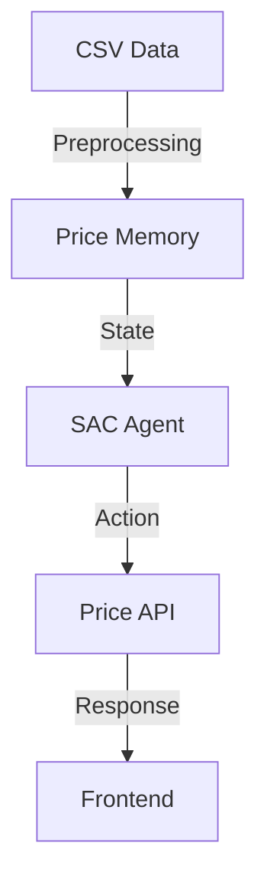

# Current System Architecture

This document provides context about the existing system that the Pear integration will enhance.

## System Components

### 1. Price Memory System
```python
# Backend/src/price_optimizer/models/price_memory.py
class PriceMemory:
    """Tracks explored price points and guides exploration."""
    
    Key Features:
    - Dynamic price range calculation
    - Exploration tracking
    - Success metrics
    - Temporal pattern recognition
```

### 2. SAC Agent
```python
# Backend/src/price_optimizer/models/sac_agent.py
class SACAgent:
    """Soft Actor-Critic agent for price optimization."""
    
    Key Features:
    - Reinforcement learning based optimization
    - Exploration bonuses
    - Price memory integration
    - Model checkpointing
```

### 3. API Layer
```python
# Backend/src/price_optimizer/api/price_api.py
class PriceOptimizer:
    """Handles price optimization with CSV data."""
    
    Key Features:
    - Model training
    - Price predictions
    - Model registry management
    - Historical data handling
```

## Directory Structure
```
Backend/
├── src/
│   └── price_optimizer/
│       ├── models/
│       │   ├── networks.py
│       │   ├── price_memory.py
│       │   └── sac_agent.py
│       ├── api/
│       │   ├── price_api.py
│       │   └── visualization_endpoints.py
│       └── data/
│           └── preprocessor.py
Frontend/
├── app/
│   └── api/
│       ├── models/
│       ├── predict/
│       └── train/
└── components/
    ├── model-history.tsx
    ├── prediction-form.tsx
    └── price-sales-chart.tsx
```

## Key Integration Points

### 1. Price Memory Enhancement
The current PriceMemory class will be enhanced with P2P capabilities:
```python
class PriceMemory:
    def update(self, price: float, reward: float):
        """Primary point for adding P2P data sharing."""
        pass

    def get_exploration_bonus(self, price: float) -> float:
        """Will incorporate network-wide exploration data."""
        pass
```

### 2. SAC Agent Modification
The SACAgent class will be modified to use network insights:
```python
class SACAgent:
    def select_action(self, state, evaluate=False):
        """Will incorporate market state from P2P network."""
        pass

    def train(self, batch_size: int):
        """Will include collaborative learning elements."""
        pass
```

### 3. API Extensions
The API layer will be extended with P2P endpoints:
```python
class PriceOptimizer:
    async def predict(self, product_id: str, config: PredictionConfig):
        """Will include network insights in predictions."""
        pass

    async def train_model(self, product_id: str, file: UploadFile):
        """Will incorporate collaborative learning."""
        pass
```

## Data Flow



## Current Limitations

1. **Isolated Learning**
   - Each instance learns independently
   - No shared market intelligence
   - Cold start problems for new products

2. **Limited Market View**
   - Only sees own historical data
   - Missing broader market trends
   - Slower adaptation to changes

3. **Resource Intensive**
   - Each instance needs full training
   - No benefit from others' experiences
   - Duplicate learning efforts

These limitations will be addressed by the Pear integration as detailed in the implementation plan.
