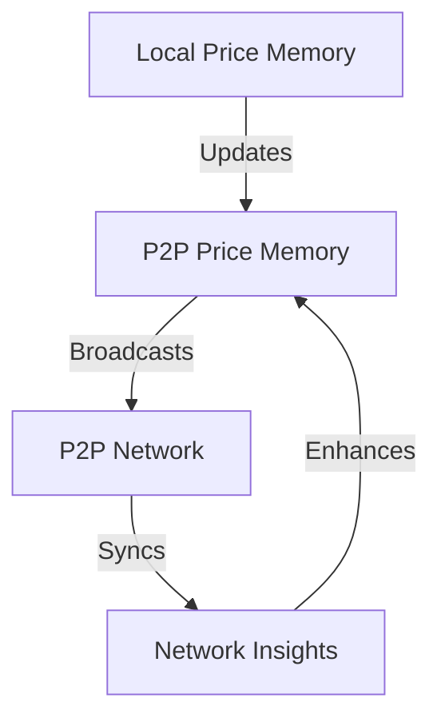
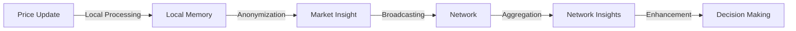

# Phase 2: Distributed Price Memory Implementation

## Overview

Phase 2 enhanced the existing price memory system with P2P capabilities, enabling distributed market intelligence and collaborative price optimization across the network.

## Components Implemented

### 1. P2P Price Memory (`p2p_price_memory.py`)
```python
class P2PPriceMemory:
    """P2P-enhanced price memory with distributed insights."""
    
    Features:
    - Local + network insight combination
    - Distributed market intelligence
    - Privacy-preserving data sharing
    - Periodic network synchronization
```

## Architecture

### 1. Hybrid Memory Model


### 2. Data Flow


## Key Features

### 1. Weighted Insight Combination
```python
def get_exploration_bonus(self, price: float) -> float:
    """Combines local and network insights."""
    local_bonus = self.local_memory.get_exploration_bonus(price)
    network_bonus = self._calculate_network_bonus(price)
    return (
        self.local_weight * local_bonus +
        self.network_weight * network_bonus
    )
```

### 2. Market Insight Sharing
```python
def _prepare_market_insight(self, price: float, reward: float) -> MarketInsight:
    """Prepares privacy-preserving market insight."""
    return MarketInsight(
        price_range={
            "min": float(price - std),
            "max": float(price + std)
        },
        trend=float(trend),
        confidence=float(confidence),
        timestamp=time.time(),
        source_type=network_mode
    )
```

### 3. Region Analysis
```python
def get_promising_regions(self) -> List[Tuple[float, float]]:
    """Identifies promising price regions from combined insights."""
    local_regions = self.local_memory.get_promising_regions()
    network_regions = self._get_network_promising_regions()
    return self._merge_regions(local_regions + network_regions)
```

## Privacy Features

### 1. Data Anonymization
- Price ranges instead of exact prices
- Aggregated trends
- Confidence-based weighting
- Time-based decay

### 2. Network Mode Adaptations
| Mode | Price Data | Success Metrics | Trends |
|------|------------|-----------------|--------|
| Private | Full | Full | Full |
| Consortium | Ranges | Aggregated | Full |
| Public | Ranges | None | Aggregated |

## Performance Optimizations

### 1. Temporal Weighting
```python
# Recent insights get higher weight
age = time.time() - insight.timestamp
recency_weight = np.exp(-age / (24 * 3600))  # 24-hour decay
```

### 2. Confidence-Based Weighting
```python
# Higher confidence insights have more influence
weight = recency_weight * insight.confidence
weighted_bonus = weight * exploration_need
```

### 3. Adaptive Synchronization
```python
async def _maybe_sync(self):
    """Syncs with network periodically."""
    if time.time() - self.last_sync >= self.sync_interval:
        await self.network.sync()
```

## Testing

### 1. Integration Testing (`test_p2p_memory.py`)
- Network interaction
- Insight sharing
- Data combination
- Region merging

### 2. Standalone Testing (`standalone_memory_test.py`)
- Mock components
- Basic functionality
- No dependencies
- Quick verification

## Usage Example

```python
# Initialize P2P price memory
memory = P2PPriceMemory(
    price_history=price_history,
    network=network,
    local_weight=0.7,
    network_weight=0.3
)

# Update with new price point
await memory.update(price=14.0, reward=0.8)

# Get exploration guidance
bonus = memory.get_exploration_bonus(price)
std = memory.get_optimal_exploration_std(price)
regions = memory.get_promising_regions()
```

## Benefits Achieved

1. **Enhanced Learning**
   - Faster convergence through shared experiences
   - Broader market understanding
   - Reduced cold-start problems

2. **Privacy Preservation**
   - Configurable data sharing
   - Anonymized insights
   - Mode-specific protections

3. **Efficient Operation**
   - Periodic synchronization
   - Weighted combinations
   - Adaptive exploration

## Future Enhancements

1. **Advanced Analytics**
   - Seasonal pattern detection
   - Anomaly identification
   - Market segmentation

2. **Dynamic Weighting**
   - Performance-based weights
   - Context-aware adaptation
   - Confidence calibration

3. **Enhanced Privacy**
   - Differential privacy
   - Secure aggregation
   - Zero-knowledge proofs
