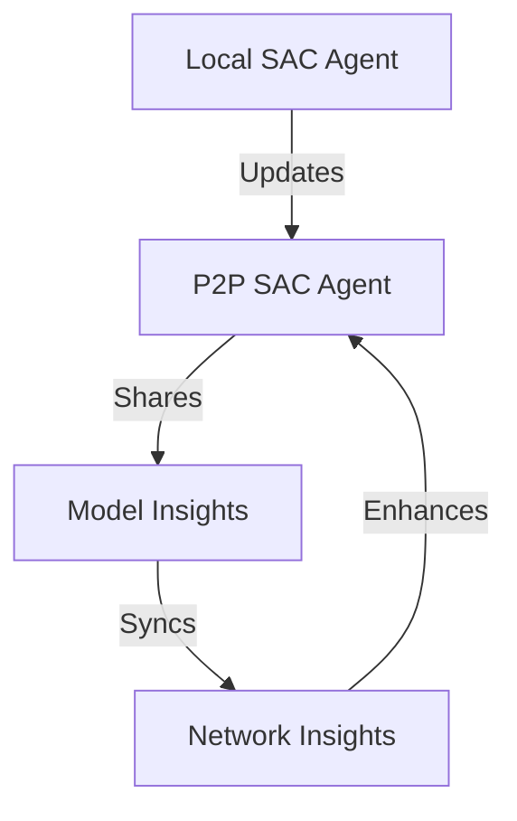
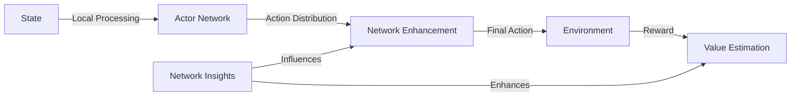

# Phase 3: Collaborative Learning Implementation

## Overview

Phase 3 enhanced the SAC agent with P2P capabilities, enabling collaborative learning and shared market intelligence across the network.

## Components Implemented

### 1. P2P SAC Agent (`p2p_sac_agent.py`)
```python
class P2PSACAgent(SACAgent):
    """P2P-enhanced SAC agent with collaborative learning."""
    
    Features:
    - Network-enhanced exploration
    - Collaborative value estimation
    - Model insight sharing
    - Periodic synchronization
```

## Architecture

### 1. Collaborative Learning Model


### 2. Information Flow


## Key Features

### 1. Network-Enhanced Exploration
```python
def select_action(self, state: np.ndarray, evaluate: bool = False):
    """Select action with network-enhanced exploration."""
    # Get base action distribution
    mean, log_std = self.actor(state)
    
    # Get network-enhanced exploration parameters
    network_std = self._calculate_network_std(state, price)
    network_bonus = self._calculate_network_bonus(state, price)
    
    # Combine local and network guidance
    final_std = (
        self.local_weight * exploration_std +
        self.network_weight * network_std
    )
```

### 2. Collaborative Value Estimation
```python
def train(self, batch_size: int):
    """Train with collaborative learning."""
    # Get network-enhanced value estimates
    network_values = self._get_network_values(states, actions)
    enhanced_q_next = (
        self.local_weight * q_next +
        self.network_weight * network_values
    )
```

### 3. Model Insight Sharing
```python
class ModelInsight:
    """Structure for sharing model insights."""
    state_value: float      # Value estimate
    action_value: float     # Action-value estimate
    entropy: float         # Policy entropy
    confidence: float      # Confidence level
    timestamp: float       # When insight was generated
```

## Privacy Features

### 1. Value Anonymization
- Share aggregated value estimates
- Mask exact state-action pairs
- Add noise to shared values

### 2. Network Mode Adaptations
| Mode | Value Data | Action Data | Entropy |
|------|------------|-------------|---------|
| Private | Full | Full | Full |
| Consortium | Aggregated | Ranges | Full |
| Public | Trends | None | Aggregated |

## Performance Optimizations

### 1. Temporal Weighting
```python
# Recent insights get higher weight
age = time.time() - insight.timestamp
recency_weight = np.exp(-age / (24 * 3600))
```

### 2. Confidence-Based Weighting
```python
# Higher confidence insights have more influence
weight = recency_weight * insight.confidence
weighted_value = weight * insight.value
```

### 3. Adaptive Synchronization
```python
async def _maybe_sync(self):
    """Periodic network synchronization."""
    if time.time() - self.last_sync >= self.sync_interval:
        await self.network.sync()
```

## Testing

### 1. Integration Testing (`test_p2p_sac.py`)
- Network interaction
- Model insight sharing
- Value estimation
- Action selection

### 2. Standalone Testing (`standalone_sac_test.py`)
- Mock components
- Basic functionality
- Training verification
- Quick testing

## Usage Example

```python
# Initialize P2P SAC agent
agent = P2PSACAgent(
    state_dim=state_dim,
    action_dim=action_dim,
    config=config,
    price_history=price_history,
    network=network,
    local_weight=0.7,
    network_weight=0.3
)

# Select action with network insights
action = await agent.select_action(state)

# Train with collaborative learning
train_info = await agent.train(batch_size=32)
```

## Benefits Achieved

1. **Enhanced Learning**
   - Faster convergence through shared experiences
   - Better generalization across market conditions
   - Reduced cold-start problems

2. **Collaborative Intelligence**
   - Network-wide value estimation
   - Shared exploration insights
   - Collective market understanding

3. **Efficient Operation**
   - Weighted insight combination
   - Adaptive exploration
   - Periodic synchronization

## Future Enhancements

1. **Advanced Collaboration**
   - Model parameter sharing
   - Experience replay sharing
   - Meta-learning capabilities

2. **Dynamic Adaptation**
   - Context-aware weighting
   - Adaptive trust levels
   - Performance-based filtering

3. **Enhanced Privacy**
   - Federated learning
   - Homomorphic encryption
   - Zero-knowledge proofs

## Integration Points

### 1. With Price Memory
```python
class P2PSACAgent:
    def __init__(self):
        self.price_memory = P2PPriceMemory(
            price_history=price_history,
            network=network
        )
```

### 2. With Network Layer
```python
class P2PSACAgent:
    def __init__(self):
        self.network = network
        self.network.register_message_handler(
            "model_insight",
            self._handle_model_insight
        )
```

### 3. With Training Pipeline
```python
class P2PSACAgent:
    async def train(self):
        # Local updates
        self._update_local()
        
        # Share insights
        await self._share_model_insight()
        
        # Sync with network
        await self._maybe_sync()
