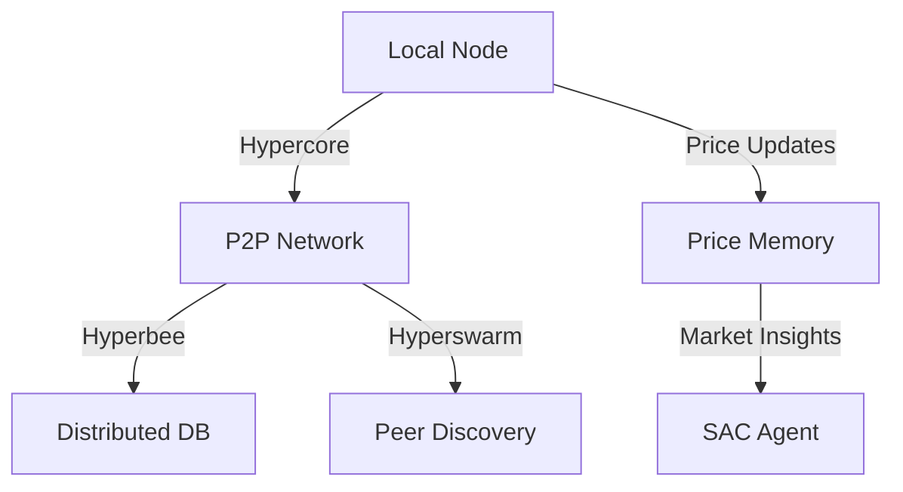
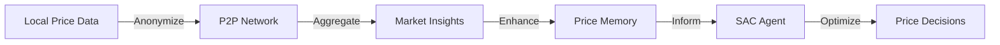
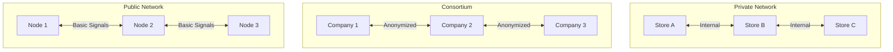
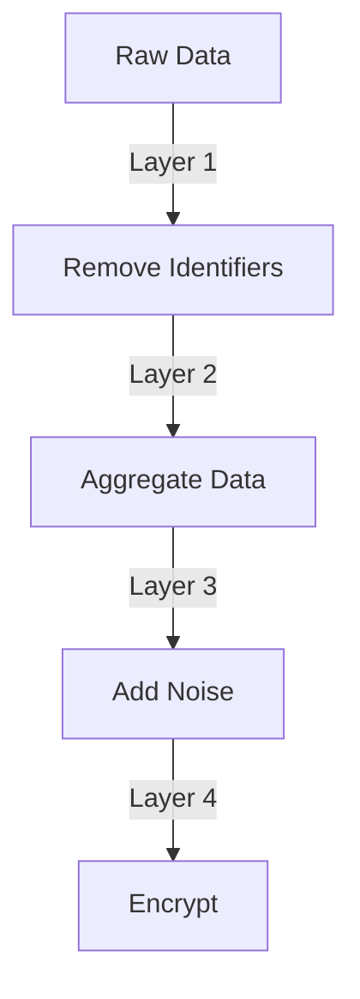

# Technical Architecture for Pear Integration

## System Components

### 1. P2P Layer


### 2. Data Flow Architecture


## Component Details

### 1. P2P Network Layer

#### Core Components
- **Hypercore**: Append-only log for price data
- **Hyperbee**: Distributed database for market insights
- **Hyperswarm**: Peer discovery and networking

#### Network Topology


### 2. Data Structures

#### Price Memory
```typescript
interface PricePoint {
    timestamp: number;
    priceRange: {
        min: number;
        max: number;
    };
    successMetric: number;
    confidence: number;
}

interface MarketTrend {
    period: string;
    trend: number;
    volatility: number;
    seasonality: number;
}
```

#### Network Messages
```typescript
interface NetworkMessage {
    type: 'price_update' | 'market_trend' | 'model_insight';
    data: {
        timestamp: number;
        payload: any;
        signature: string;
    };
    metadata: {
        network: 'private' | 'consortium' | 'public';
        version: string;
    };
}
```

### 3. Privacy Architecture

#### Data Anonymization Layers


#### Access Control Matrix
| Data Type | Private | Consortium | Public |
|-----------|---------|------------|---------|
| Raw Prices | ✓ | - | - |
| Price Ranges | ✓ | ✓ | - |
| Trends | ✓ | ✓ | ✓ |
| Model Insights | ✓ | ✓ | - |

### 4. Integration Points

#### Price Memory Integration
```python
class P2PPriceMemory:
    def __init__(self):
        self.local = LocalPriceMemory()
        self.network = NetworkPriceMemory()
        self.sync_manager = SyncManager()

    async def update(self, price_data):
        # Local update
        self.local.update(price_data)
        
        # Prepare network update
        network_data = self.anonymize(price_data)
        
        # Sync with network
        await self.sync_manager.sync(network_data)
```

#### SAC Agent Integration
```python
class P2PSACAgent:
    def __init__(self):
        self.base_agent = SACAgent()
        self.market_analyzer = MarketAnalyzer()
        self.network_state = NetworkState()

    async def get_action(self, state):
        # Get market context
        market_context = await self.network_state.get_context()
        
        # Enhance state with market context
        enhanced_state = self.combine_state(state, market_context)
        
        # Get action from base agent
        return self.base_agent.get_action(enhanced_state)
```

## Performance Considerations

### 1. Network Optimization
- Batch updates for efficiency
- Prioritize critical data sync
- Implement connection pooling

### 2. State Management
- Cache frequent queries
- Implement LRU cache for network data
- Use incremental updates

### 3. Resource Usage
- Monitor memory usage
- Implement connection limits
- Handle backpressure

## Error Handling

### 1. Network Failures
```python
class NetworkErrorHandler:
    async def handle_disconnect(self):
        # Fall back to local-only mode
        # Queue updates for later sync
        # Notify system of degraded mode

    async def handle_reconnect(self):
        # Sync queued updates
        # Rebuild network state
        # Resume normal operation
```

### 2. Data Validation
```python
class DataValidator:
    def validate_network_data(self, data):
        # Check data format
        # Verify signatures
        # Validate timestamps
        # Check data ranges
```

## Monitoring & Metrics

### 1. Network Health
- Peer connection status
- Sync latency
- Data propagation time

### 2. System Performance
- Model convergence rate
- Prediction accuracy
- Resource usage

### 3. Security Metrics
- Failed validation attempts
- Unauthorized access attempts
- Encryption overhead
