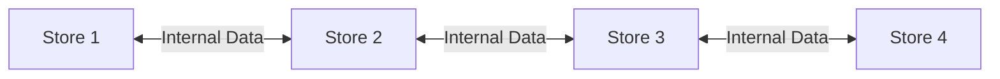
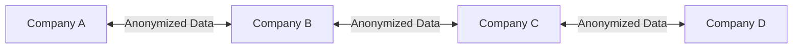
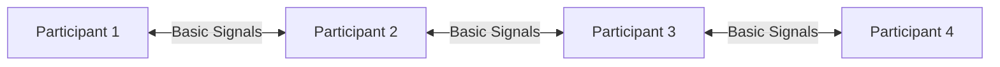

# User Guide: Pear-Enhanced Price Optimization

## Overview

This guide explains how the Pear integration enhances our price optimization system and how to use its features effectively.

## Network Modes Explained

### Private Network Mode
**Best for**: Single companies with multiple stores/departments


**Benefits**:
- Share price insights across stores
- Learn from company-wide data
- Maintain complete privacy
- Faster response to local market changes

**Example Usage**:
```python
# Configure private network
config = {
    "mode": "private",
    "company_id": "retail_chain_123",
    "stores": ["store_1", "store_2", "store_3"],
    "data_sharing": "full"
}
```

### Consortium Mode
**Best for**: Industry groups and partner networks


**Benefits**:
- Share market insights while maintaining privacy
- Learn from industry-wide trends
- Collaborate with trusted partners
- Maintain competitive advantage

**Example Usage**:
```python
# Configure consortium network
config = {
    "mode": "consortium",
    "consortium_id": "eco_retailers_group",
    "data_sharing": "selective",
    "privacy_level": "high"
}
```

### Public Network Mode
**Best for**: Market-wide participation


**Benefits**:
- Access broad market trends
- Contribute to market intelligence
- Maximum privacy protection
- Global market insights

**Example Usage**:
```python
# Configure public network
config = {
    "mode": "public",
    "data_sharing": "minimal",
    "privacy_level": "maximum"
}
```

## Getting Started

### 1. Choose Your Network Mode
Consider your needs:
- Need full data sharing within company? → Private Mode
- Want to share with partners? → Consortium Mode
- Want broad market insights? → Public Mode

### 2. Configure Privacy Settings
```python
# Example privacy configuration
privacy_settings = {
    "data_anonymization": True,
    "encryption_level": "high",
    "sharing_preferences": {
        "price_data": "ranges_only",
        "sales_data": "aggregated",
        "trends": "full"
    }
}
```

### 3. Setup Network Connection
```python
# Initialize network connection
network = PearNetwork(config)
await network.connect()

# Verify connection
status = await network.check_status()
print(f"Connected to network: {status.mode}")
print(f"Active peers: {status.peer_count}")
```

## Daily Operations

### 1. Price Optimization
The system now considers:
- Local historical data
- Network market insights
- Real-time trend data

```python
# Get optimized price
price = await optimizer.get_price({
    "product_id": "eco_product_1",
    "use_network_insights": True,
    "confidence_threshold": 0.8
})
```

### 2. Market Monitoring
```python
# Monitor market trends
trends = await network.get_trends({
    "timeframe": "7d",
    "granularity": "daily"
})

# Check market signals
signals = await network.get_signals({
    "type": "price_pressure",
    "urgency": "high"
})
```

### 3. Performance Tracking
```python
# Track optimization performance
metrics = await optimizer.get_metrics({
    "timeframe": "30d",
    "include_network_impact": True
})
```

## Best Practices

### 1. Data Quality
- Regularly validate your data
- Maintain consistent pricing patterns
- Document unusual price changes

### 2. Network Participation
- Start with minimal sharing
- Gradually increase participation
- Monitor network benefits

### 3. Privacy Management
- Regularly review privacy settings
- Monitor data sharing logs
- Update sharing preferences

## Troubleshooting

### 1. Connection Issues
```python
# Check network health
health = await network.diagnose()
if not health.is_healthy:
    print(f"Issue detected: {health.issues}")
```

### 2. Data Sync Problems
```python
# Verify data synchronization
sync_status = await network.check_sync()
if not sync_status.is_synced:
    await network.force_sync()
```

### 3. Performance Issues
```python
# Check system performance
performance = await system.check_performance()
if performance.needs_optimization:
    await system.optimize()
```

## Monitoring & Analytics

### 1. Network Health Dashboard
```python
# Get network metrics
metrics = await network.get_metrics({
    "type": "health",
    "timeframe": "24h"
})
```

### 2. Performance Impact
```python
# Analyze network impact
impact = await analyzer.get_network_impact({
    "before_period": "30d",
    "after_period": "30d"
})
```

### 3. ROI Tracking
```python
# Track benefits
roi = await analyzer.calculate_roi({
    "metric": "price_optimization",
    "timeframe": "90d"
})
```

## Security Considerations

### 1. Data Protection
- All shared data is encrypted
- Private keys never leave your system
- Regular security audits

### 2. Access Control
- Role-based permissions
- Activity monitoring
- Regular access reviews

### 3. Compliance
- GDPR compliance built-in
- Data residency options
- Audit trail maintenance

## Support & Resources

### 1. Documentation
- Technical guides
- API reference
- Best practices

### 2. Community
- User forums
- Knowledge base
- Case studies

### 3. Technical Support
- 24/7 support
- Issue tracking
- Regular updates
